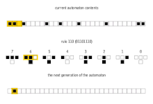

# rule110

An elementary cellular automaton with interesting behaviour on the boundary between stability and chaos.

A cellular automaton consists of some initial state and then evolves according some set of simple rules.
For rule110 each new state is determined by the current state and that of the two neighbouring cells.



## usage

```cmd
$ python rule110.py
                                                              *
                                                            * *
                                                          * * *
                                                        * *   *
                                                      * * * * *
                                                    * *       *
                                                  * * *     * *
                                                * *   *   * * *
                                              * * * * * * *   *
                                            * *           * * *
                                          * * *         * *   *
                                        * *   *       * * * * *
                                      * * * * *     * *       *
                                    * *       *   * * *     * *
                                  * * *     * * * *   *   * * *
                                * *   *   * *     * * * * *   *
                              * * * * * * * *   * *       * * *
                            * *             * * * *     * *   *
                          * * *           * *     *   * * * * *
                        * *   *         * * *   * * * *       *
                      * * * * *       * *   * * *     *     * *
                    * *       *     * * * * *   *   * *   * * *
                  * * *     * *   * *       * * * * * * * *   *
                * *   *   * * * * * *     * *             * * *
              * * * * * * *         *   * * *           * *   *
            * *           *       * * * *   *         * * * * *
          * * *         * *     * *     * * *       * *       *
        * *   *       * * *   * * *   * *   *     * * *     * *
      * * * * *     * *   * * *   * * * * * *   * *   *   * * *
    * *       *   * * * * *   * * *         * * * * * * * *   *
  * * *     * * * *       * * *   *       * *             * * *
* *   *   * *     *     * *   * * *     * * *           * *   *
```


## references
- https://en.wikipedia.org/wiki/Rule_110
